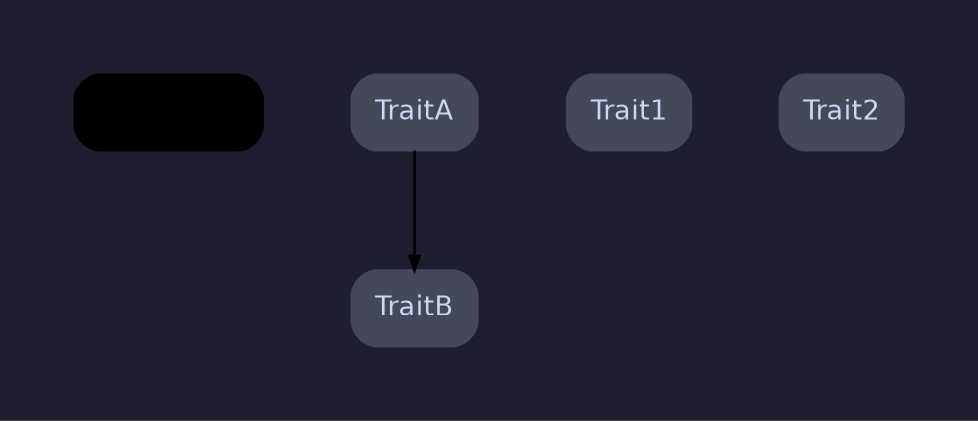

# How to Render the Component Dependency Diagram

Generate a Graphviz diagram showing how `ComponentAssembler` wires traits together.

## Step 1: Read the component assembler

Read `src/component_assembler.rs` and extract a dependency table from the factory methods. Each factory method returns a `Box<dyn Trait>` and calls `self.<dep>()` to obtain dependencies passed into `new()`.

Build a table mapping each trait to its list of dependencies. For example:

| Trait | Dependencies |
|---|---|
| Logger | _(none)_ |
| Init | Logger, DbLoadaProjectIO |
| DbLoadaEngine | Logger, Init, Load |
| ... | ... |

## Step 2: Assign layers by depth

Assign each trait a layer based on its maximum depth in the dependency graph (longest path from a root):

- **Layer 0** — Traits that no other trait depends on (top-level entry points).
- **Layer N** — Traits whose deepest dependant is at layer N-1.
- The deepest layer contains leaf traits with no dependencies.

Group traits at the same layer together using `{ rank=same; ... }` hints.

## Step 3: Write the DOT file

Write `target/component_diagram.dot` using the dark-mode Catppuccin-inspired style below.

### Color scheme per layer

| Layer | Role | fillcolor | color (border) | fontcolor |
|---|---|---|---|---|
| 0 | Top-level engine | `#45275a` | `#cba6f7` (mauve) | `#f5e0dc` |
| 1 | Command components | `#1e3a5f` | `#89b4fa` (blue) | `#cdd6f4` |
| 2 | Project IO | `#1e4040` | `#94e2d5` (teal) | `#cdd6f4` |
| 3 | IO support | `#2d3a1e` | `#a6e3a1` (green) | `#cdd6f4` |
| 4 | Foundation | `#3a2a1e` | `#fab387` (peach) | `#cdd6f4` |

If more layers are needed, interpolate new colors in the Catppuccin Mocha palette between existing layers.

### DOT template structure



### Edge coloring rules

- Edges pointing to Logger (the foundation) use the **default edge color** (`#7f849c` gray).
- All other edges use the **border color of the source node's layer** to visually trace dependency chains.

## Step 4: Render to PNG

Run:

```bash
dot -Tpng target/component_diagram.dot -o target/component_diagram.png
```

## Step 5: Verify

1. Confirm `target/component_diagram.dot` exists.
2. Confirm `target/component_diagram.png` exists and is non-empty.
3. Read the PNG to verify it renders correctly.
